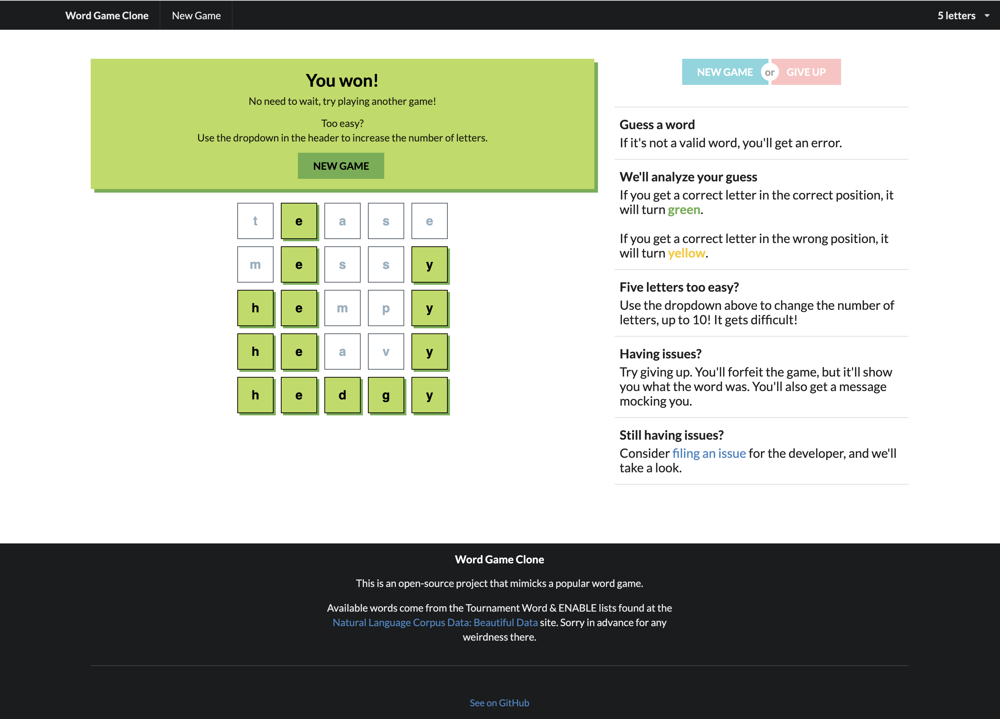

# Word Game Clone

## Just a clone of a popular word guessing game.

Built in React over a few hours (and improved over longer), because my dad didn't want to wait a whole day to play another round.

Play online at: https://christinabranson.github.io/word-game-clone/

## The Code

The UI is build in React (*mental TODO to convert type a Typescript project?). Instead of the standard 5 letters that *other* word game has - *cough, cough* - players can choose up to 10 letters for added ~~difficulty~~ fun!

The available words were generated with a small Python program located in `python-converter` which takes large lists of words for Scrabble tournament purposes, and creates files for various word lengths.

## Coming soon? Maybe? Who knows?

- Keep track of streaks (at least locally in browser)
- Add the ability to share a particurly game (without giving the word away, obviously)